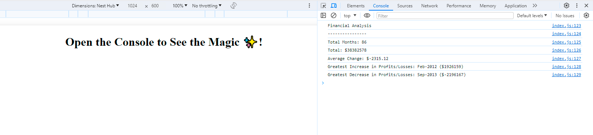

# Console-Finances
Module 4 Challenge: Console Finances

## Description 

This Console-Finances was created for bootcamp students who were taking the fourth week's challenge. In this challenge, my task was to create JavaScript code to analyse a company's financial records.

When the code is opened in a browser, the resulting analysis should look similar to the following:

  ```text
  Financial Analysis 
  ----------------
  Total Months: 86
  Total: $38382578
  Average Change: -2315.12
  Greatest Increase in Profits/Losses: Feb-2012 ($1926159)
  Greatest Decrease in Profits/Losses: Sep-2013 ($-2196167)
  ```

## Installation

N/A

## Usage 

To use this Console-Finances,  you can review each file. 

To check whether the code meets critical requirements, open the webpage [link](https://qingh2o.github.io/Console-Finances/). 

Once the Console-Finances web page loads, open Chrome DevTools by right-clicking the page and selecting "Inspect". An Elements panel should open either below or to the side of the webpage in the browser. Click on the Console to see if the analysis results show that the financial data has been analysed correctly.

The "Inspect" page should look similar to the screenshot below.



## Credits

N/A

## License

Please refer to the LICENSE in the repo.
